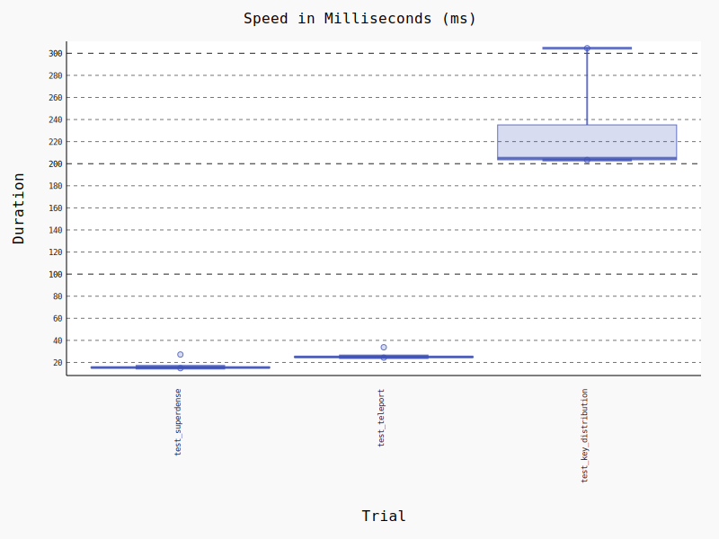

# Benchmarks




To run the benchmarks, you need to have `pytest` and `pytest-benchmark` installed. Then just run

```
pytest *.py
```

to run all benchmarks in this repository. To update the graphic of the benchmarks, run the script `bench_histogram.sh`.
